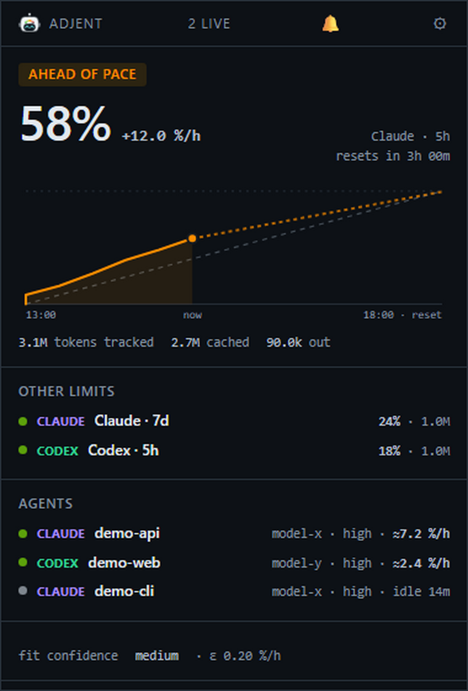

# Adjent

> **Early development / WIP.** Unreleased; run from source on Windows or Linux.
> Vendor formats are undocumented and may change. Expect rough edges and breaking
> changes before 1.0, with versioned changes to documented CLI contracts.

[](https://github.com/emreay-/adjent/actions/workflows/ci.yml)

**Observability and advisory orchestration for AI work — for humans and agents.**
People use the tray-resident monitor; agents and orchestrators use headless
interfaces to the same underlying state. Adjent answers:

> *Which agents are running right now, on what models, in which projects — and
> how much of my quota have they burned?*

Its rule-driven alarm engine warns before work hits a quota wall or gets stuck.
Its snapshots, event stream and budget gates help an orchestrator decide whether
to launch more work, defer it, or ask for human input. Human supervision is useful
today; agent-driven orchestration is a central direction for the future.

Adjent watches [Claude Code](https://claude.com/claude-code) and
[OpenAI Codex](https://openai.com/codex), read-only, on Windows and Linux.



*The actual panel, rendered with invented data. Regenerate it after building with
`node scripts/screenshot.mjs`; the monitor is not started.*

---

## Why

One agent is easy to keep in your head. Four are not.

Vendors show you a percentage when you ask. They do not tell you *which* of your
running sessions is spending it, whether you are on track to last the week, or
that the subagent you started an hour ago has been looping ever since. By the
time the number is obviously a problem, the week's budget is gone.

For a person, Adjent answers: **should I change what I am doing right now?**
For an agent or orchestrator: **can this work proceed, and what evidence should
guide the next decision?** Both need quota readings, attribution, freshness and
uncertainty. The headless interface works without the tray or a person watching it.

## What it does

- **One number that means something.** The hero figure is always
  vendor-reported utilization of the *binding* limit — the one that will stop
  you first, which is not always the fullest one. In a synthetic example, a limit at 60%
  growing 20 percentage points/hour exhausts in two hours; a fuller limit at 84%
  growing 2 points/hour lasts eight hours. Reset times then determine whether
  either will actually stop the work.
- **Per-agent attribution.** Which session, which project, which model, and what
  each is costing per hour.
- **It notices a worker that is stuck.** The `anomaly` rule watches the *shape*
  of an agent's turns — how many, how alike, whether its context is still
  growing — and flags a session or subagent that has started repeating itself.
  That is the failure a burn threshold cannot catch, because each individual
  turn looks ordinary. See the [demo](#see-it-catch-a-loop) below.
- **Alarms you can prove before you trust them.** `adjent rules test` replays
  your rules against your own recorded history and shows what would have fired.
  Edit them in the panel or in your editor — either way the file is watched, so
  a save applies without a restart.
- **An orchestration interface.** Every command speaks `--json`, `adjent check` is a
  budget gate with meaningful exit codes, and `adjent watch --json` is a JSONL
  event stream. `adjent gate` adds an advisory hold your orchestrator can read
  before launching more work — see
  [the orchestrator contract](docs/API.md#the-gate). Adjent writes a file and
  nothing else; the decision stays in your code.
- **Honest numbers.** Every figure is typed `reported`, `exact` or `derived`.
  Derived values render with `≈`; measured ones never do.

## See it catch a loop

From a clean checkout, about fifteen seconds:

```sh
pnpm install --frozen-lockfile
pnpm -r build
node scripts/demo-loop.mjs
```

It builds a throwaway home directory holding one session working normally and
one subagent of it repeating itself, runs the real `adjent status` against it,
and prints what the rule engine decided:

```
▲ [warn] Looks like a loop — demo-session
  a subagent of demo-session has run 14 near-identical turns in 15 minutes
  on model-x, with no growing context.
```

Nothing is mocked: the alarm comes from the shipped rule engine reading files
off disk. The fixture is synthetic — invented ids and numbers, no credentials —
and the temporary directory is removed afterwards.

Two things the demo is careful about, both explained in its own header comment:
the rule reads **turn metadata only**, never message content, so a semantic loop
that varies its token counts is invisible to it; and the demo config disables
the "is this worth interrupting you over" burn threshold, because that figure is
learned over hours and a five-second-old fixture has not learned it.

## Status

**Working, unreleased.** Core, CLI and desktop all build and are tested on
Windows and Linux for every push. Both providers read live data; the tray,
panel, alarm engine, notification log and CLI are in.

Not yet done: signed builds and a published release — see
[docs/PACKAGING.md](docs/PACKAGING.md) for how distribution will work, and why
Flatpak's sandbox suits a read-only monitor better than Snap's.

Until then, run it from source.

## Install

Requires **Node 22.12+** and **pnpm 9**.

```sh
git clone https://github.com/emreay-/adjent.git
cd adjent
pnpm install --frozen-lockfile
pnpm -r build
```

Then either surface:

```sh
# the desktop tray app
pnpm --filter @adjent/desktop start

# the CLI
node packages/cli/dist/main.js status
```

The source checkout does not install a global `adjent` command. In the examples
below, substitute `node packages/cli/dist/main.js` for `adjent` from the repository
root. No global installation is required.

There is nothing to configure. Adjent finds `~/.claude` and `~/.codex` if they
are there, and reports what it can if they are not.

## Understanding the numbers

- **Reported quota:** the vendor's reading, with its observation time. The hero
  shows the binding limit; burn and reset time help assess urgency.
- **Learning:** not enough observations exist to estimate per-agent quota burn.
  Token counts and reported quota can still be available.
- **Stale:** the quota observation is old. Codex records update with local API
  activity; another device can change the account without updating local files.
- **No quota reported:** no usable quota record or supported subscription
  credential was found. This does not mean zero usage.
- **Derived `≈` figures:** estimates based on local usage and observed quota
  changes. They are not billing records or guaranteed remaining capacity.

Large histories catch up over multiple ticks. Missing records, unsupported formats
and records over the parser's size limit can leave local token totals incomplete.
See [data sources and limitations](docs/DATA-SOURCES.md).

## The CLI

```
adjent status                    everything at once
adjent limits                    how full each limit is
adjent agents                    what is running, most expensive first
adjent watch                     a live loop
adjent check                     may I start more work?
adjent explain <term>            what a number means
adjent statusline                one line, for Claude Code's statusLine

adjent rules init                write ~/.adjent/alarms.yaml from a preset
adjent rules validate            check it, and print what will actually run
adjent rules test                replay your rules against your own history
adjent rules presets             list the presets and what each is for
```

Every command takes `--json`. Run `adjent --help` for the full flag list, or
read [docs/API.md](docs/API.md) — the payload shape, the exit-code table and the
compatibility promise are all on that one page.

### The budget gate

The question a fleet actually has is *"do I have room to start five more
workers?"*. That is an exit code:

```sh
# Only start the batch if a fifth of the budget is still there.
adjent check --budget 20% --quiet || exit 0

# Refuse to act on a reading more than ten minutes old.
adjent check --budget 20% --max-age 10m --quiet

# Narrow it to one limit. The keys are the vendors' own — `adjent limits --json`
# lists them, and a wrong one tells you what it should have been.
adjent check --budget 20% --limit weekly_all --quiet
```

`--budget 20%` means *at least 20% must remain*. It is judged against the
binding limit unless you narrow it, and when several limits are in scope it must
hold for **all** of them — a gate that passed because one limit had room would
green-light work the weekly limit cannot afford.

Exit codes distinguish the cases a script cares about: **0** it holds, **4** it
does not, **3** there was nothing to judge, **5** the data was too old, **2** a
flag could not be read. `4` and `3` are successful evaluations, not failures — a
CI step that treats any non-zero code as breakage will misread a working gate.

### Proving a rule before you trust it

Authoring an alarm is guesswork until you can see what it would have done:

```sh
adjent rules init --preset fleet     # five presets ship; the file is commented
adjent rules validate                # what Adjent actually understood
adjent rules test                    # what it would have done to your last week
```

`rules test` replays your rules over `~/.adjent/history.jsonl` and prints the
timeline, the per-rule counts and the longest quiet stretch — which is what
tells you whether a rule is usable or merely correct. Rules that history cannot
answer for are named as **not evaluated** rather than reported as silent.

## Principles

These are constraints, not aspirations. They are enforced in code and in CI.

1. **Read-only toward vendors.** Adjent never writes into `~/.claude` or
   `~/.codex`, never modifies credentials, and never runs an OAuth refresh —
   rotating a token could break the very tool it is monitoring. It writes only
   monitor data under `~/.adjent/`; Electron may also maintain profile/cache data.
2. **Read-only toward your agents, too.** Adjent never starts, stops, pauses or
   signals a process. See [What Adjent will not do](#what-adjent-will-not-do).
3. **Metadata only.** Parsers extract token counts, model ids, paths and
   timestamps, and discard the rest at read time. Message content never enters
   application state, so no surface can leak it.
4. **Honest numbers.** Every figure carries its provenance as data, not
   decoration. A consumer decides how to render from that; it never has to guess
   whether a number was measured or modelled.
5. **Degrade per provider, never the app.** A format change or a failed endpoint
   disables one backend's data. Parsers ignore unknown fields and never throw on
   shape drift.
6. **Cut ruthlessly in the human UI.** Everything on the resting surface must help answer
   "should I change what I am doing right now?". Everything else is one click
   away. Machine consumers use the documented data contract, independent of
   the panel's display budget.
7. **The core is UI-agnostic.** `packages/core` imports no Electron and no DOM.
   The CLI and the desktop app are thin shells over it. Humans and agents are
   both first-class consumers; human interaction is not a runtime requirement.

## What Adjent will not do

The first question a monitor has to answer is what it is allowed to do to the
things it watches. Adjent's answer is deliberately narrow, and it is a design
decision rather than a gap waiting to be filled.

**Adjent never touches a running process.** It does not start agents, stop
them, pause them, or send them a signal of any kind. It does not know their
process IDs for any purpose beyond telling whether a session is still alive. If
every agent on your machine is looping and burning a week's quota, Adjent
reports the evidence and can publish an advisory hold through configured rules.
A person or an orchestrator decides how to respond. Keeping enforcement in the
caller lets it account for the workload and the cost of interrupting it.

**Adjent never writes into a vendor's files.** Not `~/.claude`, not `~/.codex`,
not credentials, not caches. Its monitor data defaults to `~/.adjent/`; Electron also maintains shell data. A `401`
from a quota endpoint is a normal state to be waited out, not a token to be
refreshed.

**The advisory gate, and its boundary.** The implemented capability in
this area is an *advisory gate*: Adjent writes a small file saying "hold" or
"open", and a wrapper script or orchestrator you control decides whether to
honour it before launching more work. That is cooperative — the decision and the
enforcement stay in your code. It is not process control wearing a different
name, and there is no version of Adjent planned that pauses or stops an agent
itself. Automatic rule actions sit behind a switch that is off by
default; a human running a command is never gated by it.

**The gate now exists**, and it still signals nothing. `adjent gate status`
exits 0 when open and 4 when held; `adjent check` consults it; the contract and
a worked example are in [docs/API.md](docs/API.md#the-gate). A rule can set it
only when you turn `actions.enabled` on, and even then it may hold and never
release automatically — releasing belongs to the caller's policy. An authorized
orchestrator can operate this contract without a human approving each decision.

## Privacy

Adjent reads local agent metadata. For Claude quota, it reads the existing access
token and contacts Anthropic's private usage endpoint. It never modifies credentials
or refreshes tokens. Codex quota is read locally without accessing Codex credentials.

Transcript lines temporarily pass through memory for parsing; message content is
not retained in normalized state or sent by Adjent. There is no telemetry or
automatic crash-report upload. Configured webhooks receive alarm payloads.

Paths, project/session labels, identifiers and usage figures **are retained
metadata** and may expose private information in snapshots, alarms or screenshots.
Review and redact before sharing. Snapshot machine identity is randomly generated,
not derived from a hostname or username. See [SECURITY.md](SECURITY.md).

## Documentation

| Doc | What it covers |
| --- | --- |
| [docs/API.md](docs/API.md) | The snapshot shape, exit codes, the event stream, the compatibility promise |
| [docs/ARCHITECTURE.md](docs/ARCHITECTURE.md) | Stack, module layout, the provider interface |
| [docs/DATA-SOURCES.md](docs/DATA-SOURCES.md) | Verified on-disk formats for both vendors |
| [docs/GLOSSARY.md](docs/GLOSSARY.md) | Every term, and how burn rate is actually derived |
| [docs/UI.md](docs/UI.md) | Information design — the budget, the one chart, the units |
| [docs/ALARMS.md](docs/ALARMS.md) | The alarm models, formalised |
| [docs/PACKAGING.md](docs/PACKAGING.md) | Distribution channels, sandboxing, signing, updates |
| [docs/ROADMAP.md](docs/ROADMAP.md) | Milestones, expansion, risks |
| [docs/PUBLICATION.md](docs/PUBLICATION.md) | History audit, source export and public WIP preparation |

## Development

```sh
pnpm -r build        # build every package, in dependency order
pnpm -r typecheck    # requires a build first: packages typecheck against dist
pnpm -r test         # vitest, no watch
node --test scripts/test/*.test.mjs
node scripts/repo-hygiene.mjs
node packages/cli/test/smoke.mjs
```

CI runs the same sequence on `ubuntu-latest` and `windows-latest` for every push
and pull request, plus version checks, synthetic CLI/renderer checks and
repository guards. Hygiene checks flag selected home-path and credential patterns
without printing matched values; they cannot prove examples or history are safe.
LF line endings are checked in the index.

Layout:

```
packages/core       providers, quota model, alarm engine, snapshot API
packages/cli        headless CLI — a thin shell over core
packages/desktop    Electron tray, panel, widget
```

**No native modules.** No `better-sqlite3`, no `node-notifier`, nothing needing
node-gyp or a prebuild matrix. Storage is JSON and JSONL under `~/.adjent/`;
notifications are Electron's own. If a dependency needs a native build, the
answer is a different dependency.

## Contributing

Issues and pull requests are welcome — see
[CONTRIBUTING.md](CONTRIBUTING.md) for the setup, the house rules and what a
good PR looks like. There is **no CLA**: contributions are accepted under the
same MIT terms as the project, and a sign-off line is all that is asked.

For vulnerabilities, follow [SECURITY.md](SECURITY.md); do not post private
diagnostics or complete transcripts in public issues.

## Licence

[MIT](LICENSE).
