# Adjent, explained through examples

Adjent monitors Claude Code and Codex for people and agent orchestrators.
These articles explain the decisions behind the tray UI and headless interface.
All account figures, sessions and projects in the examples are synthetic.

| Article | The question it answers |
| --- | --- |
| [Token counts and subscription quota](token-counts-and-quota.md) | Why can't I divide tokens by a fixed allowance? |
| [Detecting agent loops](detecting-agent-loops.md) | What can turn metadata tell us about a stuck worker? |
| [An orchestrator's quota gate](orchestrator-quota-gate.md) | How should automation distinguish permission, uncertainty and failure? |

The detailed [glossary and derivation](../GLOSSARY.md), [alarm design](../ALARMS.md)
and [API contract](../API.md) remain the reference material. These articles are
shorter paths into that material, not replacements for it.

## The 30-second demo



The animation repeats every 30 seconds. A text equivalent:

1. **0–7.5 seconds:** the real panel renders invented projects and usage. The
   large percentage is reported utilization; per-agent estimates carry `≈`.
2. **7.5–15 seconds:** the real CLI detects 14 uniform subagent turns in a
   15-minute lookback. Its alarm says “Looks like a loop.” This is evidence to
   inspect, not proof that a worker is stuck.
3. **15–22.5 seconds:** a synthetic Codex reading at 58% passes a requirement
   for 20% remaining. Another reading at 88% returns exit code 4.
4. **22.5–30 seconds:** an explicit advisory hold returns exit code 4 even
   when the synthetic account has headroom. The caller decides to defer work.

The panel and CLI fixtures are separate examples. The animation composes an
actual panel screenshot and checked CLI results; it is not a live desktop
recording. It does not claim that the loop automatically sets a hold.

### Reproduce it

Requires Node 22.12+ and pnpm 9. From a source checkout:

```sh
pnpm install --frozen-lockfile
pnpm -r build
node scripts/demo-loop.mjs
node scripts/demo-discovery.mjs
```

The second script verifies the loop alarm and quota/hold exit codes, then
regenerates `docs/assets/demo.svg`. It uses temporary synthetic vendor files
without credentials, cleans them up, and never starts a real worker. The source
checkout does not install a global `adjent` command; the generator invokes the
built CLI through Node.

To refresh the actual panel screenshot first, run `node scripts/screenshot.mjs`.
That renders fixture state without starting the monitor. To render the social
preview PNG, run `node scripts/demo-discovery.mjs --social-preview` after building.
Electron rendering requires a desktop environment (or the repository's Linux
CI sandbox/display setup).

The loop fixture sets its burn floor to zero because a fresh fixture has no
learned exchange rate. The production preset retains that floor. The quota
fixture uses invented local Codex records, so it needs no network access or
vendor credentials. All demonstration settings live in temporary homes.

## Sharing these explanations

Each article can be linked independently. Preserve its synthetic-data label and
limitations if adapting it for a blog or community post, and link back to the
full derivation. Keep code examples tied to the current API contract.

`docs/assets/social-preview.png` is a 1280 × 640 share image. Upload it through
the repository's **Settings → General → Social preview**; committing the image
alone does not configure GitHub's link preview.
